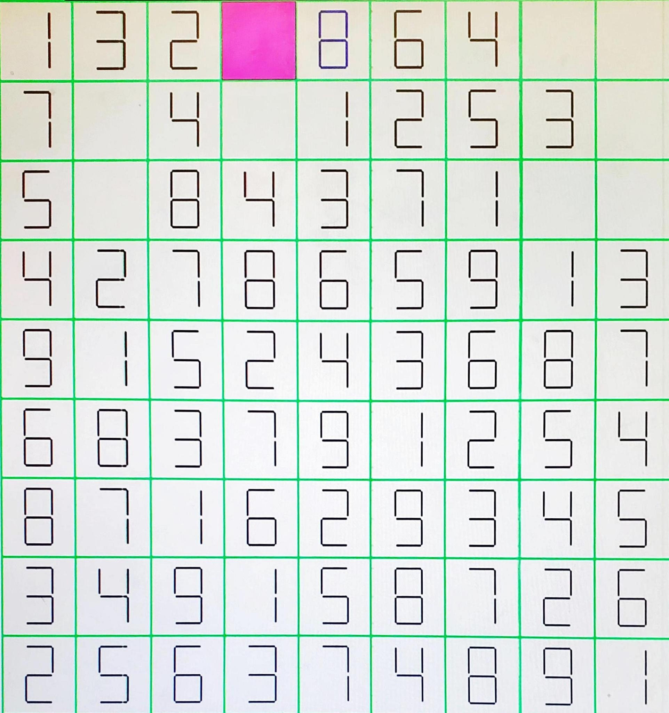

# Sudoku

We implemented the game of Sudoku using Verilog on a [Nexys3 board](https://digilent.com/reference/programmable-logic/nexys-3/). We had classic Sudoku puzzles as well as [Chess Sudoku](https://en.chessbase.com/post/chess-sudoku) ones.



## Design

The player selects numbers, resets the current game, and can go to the next game by controlling a keypad. The player can move up, down, left, right, and pause using 5 buttons on the Nexys3 board.

The game displays on a monitor using a [vga display controller](https://digilent.com/reference/learn/programmable-logic/tutorials/vga-display-congroller/), implemented by [vga.v](vga.v).

We track the time for a given puzzle and display it on a 4-digit 7-segment display.


To store the puzzles, we encoded the grid into a 324 binary string where each of the 81 squares is represented in BCD. 

```py
s = ''
for r in range(9):
    for c in range(9):
        s += bin(puzzle[r][c])[2:].rjust(4,'0')
```

## Acknowledgments

* vga.v is modified from https://community.element14.com/technologies/fpga-group/f/forum/20876/draw-vga-color-bars-with-fpga-in-verilog

* Decoder.v is taken from [https://digilent.com/reference/programmable-logic/nexys-3/](https://digilent.com/reference/programmable-logic/nexys-3/start?redirect=1#:~:text=PmodKYPD)
